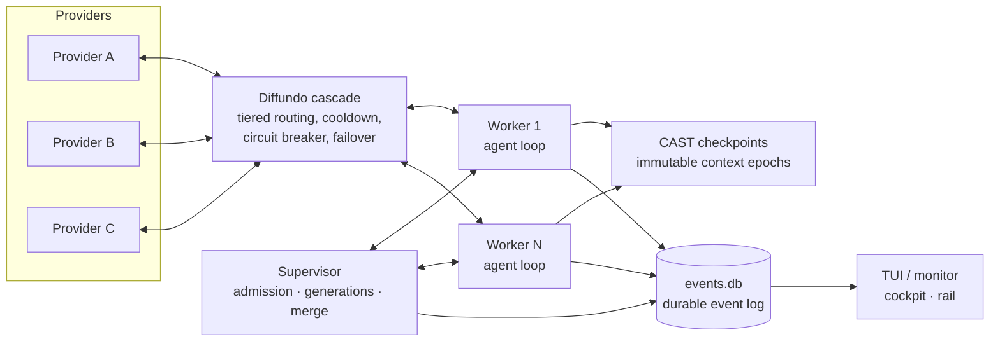

# Cambium architecture

## What Cambium is

Cambium is a local multi-agent orchestrator that runs coding tasks through LLM
providers. A supervisor spawns worker processes in Git worktrees, each worker
drives a bounded agent loop against the Diffundo provider cascade, and durable
events plus fenced commits make every outcome recoverable. It runs directly
from source — no wheel, no install.

## Big picture



## Components

**Diffundo** (`diffundo.py`, `routing.py`, `provider_config.py`) — a tiered
multi-provider router. Within a tier it orders candidates by measured evidence
(success, latency, throughput, cache hits) with rotation seeding and incumbent
stickiness; across tiers it cascades on failure. Per-provider token buckets
and in-flight caps gate admission, cooldowns and a circuit breaker quarantine
unhealthy providers, and a per-tier recovery monitor re-admits them. A pinned
provider keeps its task association until terminal-death evidence (auth 401/403,
endpoint 5xx, or transport failure), at which point authorized fallbacks are
tried in-tier first and the router sticks with the survivor. There is no local
response cache: `provider_cache_hit` records only what the provider itself
reports.

**Supervisor** (`supervisor.py`, `tasktree.py`, `merge.py`, `fencing.py`) —
owns the plan and the lifecycle. `run_plan` validates task records, builds a
`TaskTree` when tasks carry `depends_on` (static ready-node waves bounded by
`max_width`), and fans out flat plans under a CPU-count worker cap. Per task it
runs generations in an `asyncio.TaskGroup`: admission, spawn, restart-resume on
recoverable failure, worktree salvage before any destructive cleanup, and merge.
A succeeded worker publishes through an expected-old atomic update of
`refs/heads/main` — ref-only, never touching the caller's checkout; conflicts
surface as a structured `merge_conflict` envelope. Hierarchical plans support
plan mode: a parent proposes typed child revisions (`propose_child`), the
supervisor validates and durably admits them before dispatch, and the
transactional join enforces `post_join_parent_HEAD == accepted_integration_HEAD`.

**Worker** (`worker.py`, `tools.py`, `schemas.py`, `ipc.py`) — one process per
task, in its own Git worktree and process group, speaking bounded NDJSON over
stdio. With a `fanout_config` it runs the agent loop: each turn calls Diffundo
and requires exactly one strict JSON action — `plan`, `tool_call`, or `finish` —
dispatched against a six-tool roster: `delegate`, `read_batch`, `write_file`,
`edit_file`, `git_op`, `run_shell`. The loop bounds turns, tokens, wall time,
and transcript size; finalization creates at most one fenced commit (zero for a
clean no-change finish) gated by the task's `requires_commit` flag, and returns
a redacted result envelope.

**Store** (`store.py`, `results.py`) — `EventStore` at `.cambium/events.db` is
the durable boundary: a bounded writer queue, critical-kind admission that
waits for the writer, and observer copies that cannot mutate persisted rows.
Interactive TUI turns keep per-turn stores under `turn-NNNN/.cambium/` that the
supervisor aggregates into one session timeline at read time. The canonical
root result lands in `.cambium/result.json`.

**TUI** (`tui.py`, `tui_screen.py`, `interactive.py`, `monitor.py`) — the
interactive cockpit: a persistent semantic branch where each turn runs the
same worker/store machinery, rendered as a live cockpit transcript with an
agent rail (task tree state) and a ticker of turn activity. Slash commands
(`compact`, `dashboard`, `clear`, …) drive context rollover and inspection;
the monitor replays the same event stream for batch runs.

**Modules and optimize** (`modules/`, `optimize.py`, `opencode.py`,
`scripts/extract_pi.py`) — optional training-data machinery. Optimizable
modules declare a DSPy program and label field in a manifest; `cambium
optimize` runs zero/bootstrap/GEPA optimizers and a dataset evaluator, fed by
review-gated candidate extraction from OpenCode and pi session transcripts.
None of it is on the task-execution path.

## Key invariants

- **Durable events are the contract.** If it isn't in `events.db`, it didn't
  happen; critical events wait for the writer or the failure is visible.
- **CAST checkpoints are `{content, meta}`** — immutable, content-addressed
  epochs; a fold writes a successor epoch and never mutates the old head.
- **Provider-cache evidence comes only from the provider** — the router sends
  `cache=False` and never maintains a local response cache.
- **The success invariant honors `requires_commit`**: a task that must commit
  cannot succeed empty-handed.
- **Single fenced commit per task** — the generation fence file bounds one
  worker to at most one commit; a clean no-change finish owns zero.
- **Salvage before prune** — a dirty worktree's diff is captured durably
  (`worktree_salvaged`) before any recovery or cleanup can destroy it.

## Repo map

```text
src/cambium/        package: supervisor, worker, diffundo, store, tui, ...
  modules/          optimizable modules (example, should_review)
tests/              unit + scenario tests (the behavioral spec)
docs/architecture/  the focused subsystem contracts (see below)
scripts/            extraction and smoke-test drivers
artifacts/          pipeline state (e.g. reviewed training snapshots)
optimized/          optimizer program output
agents.md           operating contract for contributors
implementation-plan.md  delivery order for open contracts
```

## Pointers

- [operations.md](operations.md) — running and operating sessions
- [context-engine.md](context-engine.md) — context reuse and compaction
- [terminal-interface.md](terminal-interface.md) — terminal rendering contract
- [provider-routing.md](provider-routing.md) — Diffundo tiers, health, ordering
- [interactive-tui.md](interactive-tui.md) — cockpit turns and slash commands
- [events.md](events.md) — event-kind glossary for `events.db`
